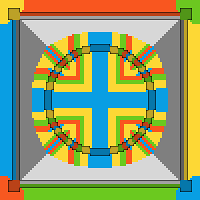
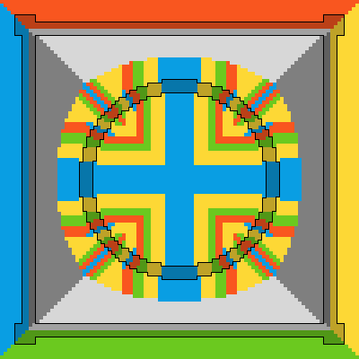
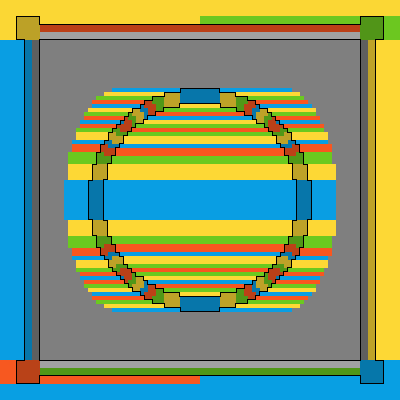

fillalpha
=========

This tool is intended for images with an alpha channel.
To reduce color bleeding, it grows visible colors into
areas where the alpha value is below a given threshold.
The alpha channel itself is left unchanged.

New colors are copied from neighbors, not interpolated.
Horizontal and vertical growth is prioritized, to facilitate
repetitive byte patterns and improve compressibility.

The tool reads and writes ordinary PNG images.
Only the pixel data is processed, metadata is ignored.


Usage
-----

```
USAGE
  fillalpha [-l] [-t ALPHA] [-h] [-v] SOURCE TARGET

OPTIONS
  -l, --linear           Only grow visible colors horizontally,
                         for the most repetitive byte patterns
  -t, --threshold ALPHA  Alpha values up to this threshold
                         are considered invisible (default: 0)
  -h, --help             Print help and exit
  -v, --version          Print version and exit

OPERANDS
  SOURCE  Source PNG image
  TARGET  Target PNG image, overwrites existing
```


Examples
--------

All example images are scaled to 400%. Output images are shown
without their alpha channel, to showcase the fill patterns.
Black outlines mark visible areas. Consider as input:


```
fillalpha input.png default.png
```



```
fillalpha --threshold 127 input.png threshold.png
```



```
fillalpha --linear input.png linear.png
```




Build
-----

On Linux, it can be compiled and installed with:

```
mkdir build
cd build
cmake -DCMAKE_BUILD_TYPE=Release ..
make
sudo make install
```


Credits
-------

This tool uses `stb_image.h` and `stb_image_write.h` from the
[stb public domain library collection](https://github.com/nothings/stb).
With thanks to Sean Barrett and everyone who worked on these libraries.
